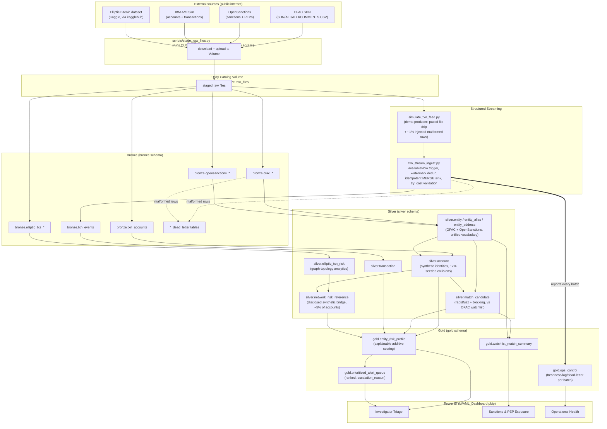

# Architecture

## Layer responsibilities

- **Staging** (`scripts/stage_raw_files.py`): the only layer that talks to the public
  internet — a real, load-bearing constraint discovered mid-build, not a design preference
  (see `docs/02_environment_and_branching.md`). Runs locally or in CI, never inside a
  Databricks job.
- **Bronze**: raw fidelity, source schema preserved, ingestion metadata attached, malformed
  rows quarantined rather than dropped or crashing the job. OFAC/AMLSim/Elliptic are batch;
  transaction events are the one streaming source.
- **Silver**: normalization, entity resolution, fuzzy matching, transaction modeling. This is
  where the two disclosed synthetic bridges live (account identities, Elliptic network-risk
  linkage) — both documented plainly in `docs/00_business_charter.md`, never presented as
  real KYC or real cross-dataset linkage.
- **Gold**: explainable, rule-based scoring. Every point on `composite_risk_score` traces to
  a named factor in `top_contributing_factors` — no black-box weighting.
- **Ops control**: not a separate layer so much as a cross-cutting concern — every ingestion
  job (currently the streaming consumer; Bronze batch jobs are the natural next addition)
  reports into `gold.ops_control` so a stalled or degraded pipeline is visible rather than
  silent.

## Environments

One Databricks Free Edition workspace, three Unity Catalog catalogs
(`aml_dev`/`aml_test`/`aml_prod_sim`) as the environment boundary — see
`docs/02_environment_and_branching.md` for why (no multi-workspace support on this tier) and
`docs/04_streaming_incident_response.md` for the real incident that shaped the streaming
consumer's reliability design.
